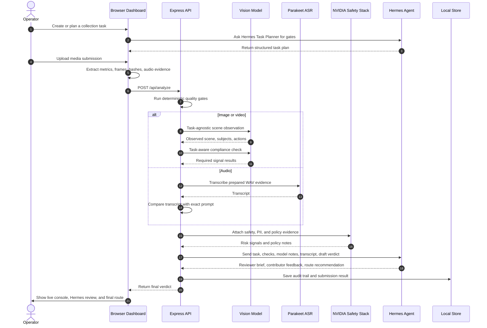

# Hermes Quality

Hermes Quality is a Hermes-orchestrated quality gate for multimodal training-data submissions. It screens video, image, and audio files before they enter a dataset pipeline or a human review queue.

The project was built for the Hermes Agent Creative Hackathon. It is a working demo, but the shape is meant to feel like real infrastructure: contributors upload data, the system checks whether the media matches the collection task, and Hermes writes an auditable routing decision.

## Why This Exists

More data collection and robotic data training networks are appearing. Examples include [Hub](https://hub.xyz/), [PSDN](https://psdn.ai/), [Zen-O](https://zen-o.xyz/), and [Numo Labs](https://numolabs.ai/). These systems ask contributors for specific training data:

Decentralized data collection and robotic training networks have been rapidly emerging, especially within creator-driven platforms.

[Hub](https://hub.xyz/), [PSDN](https://psdn.ai/), [Zen-O](https://zen-o.xyz/), and [Numo Labs](https://numolabs.ai/).are building next-generation infrastructure that leverages user contributions to collect multimodal data (video, image, audio) and feed AI training pipelines.

In these systems, users are not only providing data, but also becoming part of the model development process through contributions like bandwidth, compute, or labeled datasets.

- first-person videos
- object manipulation clips
- prompted speech recordings
- images with requested people, places, or objects
- robotics and embodied AI examples

The hard part is not only file upload. The hard part is quality control.

A video can have the right duration and resolution but still be useless because it shows the wrong activity. An audio file can be loud and clean but still say the wrong sentence. A human reviewer can catch this, but reviewing every obvious mismatch wastes time.

Hermes Quality is the first pass before that review queue.

## Plain Explanation

Think of the app like a strict intake desk.

1. You tell Hermes what data you need.
2. Hermes turns that request into a structured collection task.
3. A contributor uploads a file.
4. The browser extracts basic evidence from the file.
5. Vision or speech models inspect the content.
6. Hermes reads all evidence and explains what should happen next.
7. The app accepts, rejects, or sends the item to human review.

Example:

```text
Task: I need POV motorcycle riding videos.
Upload: A POV bicycle riding video.
Result: Reject.
Reason: The technical file is fine, but the scene does not match the requested motorcycle task.
```

This is the key idea: technical quality can never compensate for wrong content.

## What Hermes Does Here

Hermes is not the raw vision model. Hermes is not the ASR model. Hermes is the decision orchestrator.

In this project Hermes:

- plans new collection tasks from natural language
- loads the local `data-quality-gate` skill
- reads deterministic checks, model notes, transcript, privacy evidence, and task signals
- writes a reviewer-ready brief
- gives contributor-facing feedback
- recommends one route: `accept`, `reject`, `send_to_human_review`, or `request_more_evidence`
- can finalize safe routing when model and technical evidence are strong enough

Specialized models do the media understanding. Hermes turns their outputs into a usable workflow decision.

## Architecture

```mermaid
flowchart LR
  operator["Dataset Operator<br/>Natural language request"]
  hermesPlan["Hermes Task Planner<br/>turns request into gates"]
  task["Collection Task<br/>media type, must-show signals, review flags"]
  upload["Contributor Submission<br/>image, video, or audio"]
  browser["Browser Evidence Pack<br/>metrics, hashes, frames, audio prep"]
  gates["Deterministic Gates<br/>duration, resolution, audio level, duplicates"]
  models["Specialized Models<br/>vision, ASR, safety, PII, policy"]
  signals["Evidence Layer<br/>semantic signals, transcript, model notes"]
  hermesReview["Hermes Data Quality Gate<br/>review orchestrator"]
  route{"Final Route"}
  accept["Accept<br/>ready for intake"]
  reject["Reject<br/>clear mismatch or hard failure"]
  review["Human Review<br/>ambiguous or sensitive evidence"]

  operator --> hermesPlan --> task --> upload --> browser
  browser --> gates
  browser --> models
  gates --> hermesReview
  models --> signals --> hermesReview
  task --> hermesReview
  hermesReview --> route
  route --> accept
  route --> reject
  route --> review

  classDef human fill:#f7f9fb,stroke:#8ea0b2,color:#111827
  classDef hermes fill:#e7f5f2,stroke:#0f766e,color:#0f2f2b
  classDef evidence fill:#e6f0fb,stroke:#245e9d,color:#102a43
  classDef decision fill:#fff1d8,stroke:#a35f00,color:#4a2a00
  classDef reject fill:#ffe5df,stroke:#b42318,color:#5f130d
  classDef accept fill:#dff4e5,stroke:#16803c,color:#0d3f20

  class operator,upload human
  class hermesPlan,hermesReview hermes
  class browser,gates,models,signals evidence
  class route decision
  class reject reject
  class accept accept

```



## Runtime Flow



## Model Stack

| Layer | Model or system | Link | Role |
| --- | --- | --- | --- |
| Orchestration | Hermes Agent | [GitHub](https://github.com/NousResearch/hermes-agent), [Docs](https://hermes-agent.nousresearch.com/docs) | Plans tasks and writes final review guidance |
| Local skill | `data-quality-gate` | `hermes/skills/data-quality-gate/SKILL.md` | Teaches Hermes how this quality gate should reason |
| Vision | Nemotron Nano 12B v2 VL | [NVIDIA Build](https://build.nvidia.com/nvidia/nemotron-nano-12b-v2-vl) | Describes frames and checks visual task compliance |
| Vision provider | Bitdeer endpoint | [BITDEER](https://www.bitdeer.ai/en/model/explore/mo-d5ofr2u94vb5u8hemrb0?utm_source=build.nvidia.com&utm_medium=referral&login_hint=2049149668604121088) | Hosted endpoint used by this demo for the VLM |
| ASR | Parakeet TDT 0.6B v2 | [NVIDIA Build](https://build.nvidia.com/nvidia/parakeet-tdt-0_6b-v2) | Transcribes prompted speech recordings |
| Safety | Nemotron 3 Content Safety | [NVIDIA Build](https://build.nvidia.com/nvidia/nemotron-3-content-safety) | Flags unsafe multimodal content |
| Policy reasoning | Nemotron Content Safety Reasoning 4B | [NVIDIA Build](https://build.nvidia.com/nvidia/nemotron-content-safety-reasoning-4b) | Applies custom policy reasoning to the evidence |
| PII | GLiNER PII | [NVIDIA Build](https://build.nvidia.com/nvidia/gliner-pii) | Detects personal identifiers in transcript text |
| Optional embedding | NV-CLIP | [NVIDIA Build](https://build.nvidia.com/nvidia/nvclip) | Optional image-text embedding layer, not required for the current demo |
| Optional video forensics | Synthetic Video Detector | [NVIDIA Build](https://build.nvidia.com/nvidia/synthetic-video-detector) | Optional synthetic-video check, private access required |
| Optional speaker signal | Active Speaker Detection | [NVIDIA Build](https://build.nvidia.com/nvidia/active-speaker-detection) | Optional video speaker identity tracking, not required for current demo |

## How Each Part Works

### Browser evidence extraction

The browser never just uploads a blind file. It extracts:

- media type
- width and height
- duration
- brightness
- blur score, only if the task asks for sharpness
- audio RMS level
- silence ratio
- perceptual hash for duplicate checks
- video contact sheets and segment contact sheets
- 16 kHz mono WAV evidence for ASR

This gives the backend a cheap and fast first layer of evidence.

### Deterministic gates

The verdict engine checks things that do not need AI:

- wrong media type
- too short or too long
- resolution below task requirement
- audio too quiet
- too much silence
- duplicate files
- optional sharpness threshold

These checks are useful, but they are not enough. A perfect 1080p video of the wrong activity is still bad data.

### Vision evidence

For image and video tasks, the app uses two passes:

1. Task-agnostic observation.
   The VLM describes what is visible without being told the task labels. This helps catch obvious mismatches.

2. Task-aware compliance.
   The VLM receives the collection task and checks whether required signals are present.

The app then merges both. If the task asks for motorcycle riding and the observation says bicycle riding, the semantic score is capped low even if duration and resolution pass.

### Audio evidence

For audio tasks:

1. The browser converts audio into ASR-ready WAV evidence.
2. NVIDIA Parakeet ASR transcribes the speech.
3. The app compares the transcript with the exact prompt.
4. If the phrase does not match, the item is rejected even if audio quality is good.

### Safety, PII, and policy evidence

The NVIDIA safety stack adds risk signals:

- content safety for unsafe media or text
- PII detection for names, addresses, phone numbers, emails, and similar identifiers
- policy reasoning for task-specific review concerns

These signals usually do not replace the task match. They decide whether a clean-looking item should be escalated.

### Hermes review orchestration

Hermes receives a compact JSON packet:

- task name and objective
- required task signals
- review-if-seen signals
- media metrics
- deterministic check results
- model-derived semantic signals
- model notes
- ASR transcript
- draft verdict and score

Hermes returns JSON:

```json
{
  "headline": "Task mismatch detected",
  "reviewBrief": "Short evidence-based explanation for the operator.",
  "recommendedAction": "reject",
  "contributorFeedback": "This task asks for motorcycle riding, but the submission appears to show bicycle riding.",
  "routingReason": "Semantic evidence is more important than passing file-level checks.",
  "reviewChecklist": ["Concrete reviewer check 1", "Concrete reviewer check 2"]
}
```

That is why Hermes is central. It converts model noise and rule checks into an operator-facing decision.

## Installation

These steps assume Windows with WSL2, because Hermes currently expects Linux, macOS, WSL2, or Termux. Native Windows is not the recommended path.

### 1. Prerequisites

Install:

- Node.js 20 or newer
- npm
- WSL2 with Ubuntu
- Python 3 and pip inside WSL
- an NVIDIA Build account and API keys
- a Bitdeer API key if you use the hosted Nemotron Nano VL endpoint

Useful official links:

- Hermes Agent: <https://github.com/NousResearch/hermes-agent>
- Hermes docs: <https://hermes-agent.nousresearch.com/docs>
- NVIDIA Build models: <https://build.nvidia.com/models>
- Ufuk Degen's Hermes thread: <https://x.com/UfukDegen/status/2045523107847278865>

### 2. Install project dependencies

```powershell
cd C:\Users\pc\Desktop\hermes\data-quality-agent
npm install
```

### 3. Create `.env`

```powershell
Copy-Item .env.example .env
```

Do not commit `.env`.

### 4. Configure NVIDIA hosted endpoints

For each NVIDIA Build model page:

1. Open the model link.
2. Click `Get API Key`.
3. Paste the key into `.env`.
4. If you use the same key for all models, set `NVIDIA_API_KEY`.
5. If Build gives separate keys per model, set the model-specific variables.

Example:

```env
NVIDIA_API_KEY=
NVIDIA_SAFETY_API_KEY=
NVIDIA_POLICY_API_KEY=
NVIDIA_PII_API_KEY=
NVIDIA_ASR_API_KEY=
NVIDIA_NVCLIP_API_KEY=
NVIDIA_ACTIVE_SPEAKER_API_KEY=
```

The model IDs are already in `.env.example`:

```env
NVIDIA_SAFETY_MODEL=nvidia/nemotron-3-content-safety
NVIDIA_POLICY_MODEL=nvidia/nemotron-content-safety-reasoning-4b
NVIDIA_PII_MODEL=nvidia/gliner-pii
NVIDIA_ASR_MODEL=nvidia/parakeet-tdt-0.6b-v2
NVIDIA_NVCLIP_MODEL=nvidia/nvclip
NVIDIA_ACTIVE_SPEAKER_MODEL=nvidia/active-speaker-detection
```

### 5. Configure Parakeet ASR bridge

The Parakeet hosted path uses NVIDIA Riva gRPC. Install the Riva Python client in WSL:

```bash
python3 -m pip install -U pip
python3 -m pip install -U nvidia-riva-client
```

Keep these values in `.env`:

```env
ASR_RUNNER=wsl
ASR_WSL_DISTRO=Ubuntu-22.04
ASR_SERVER=grpc.nvcf.nvidia.com:443
ASR_LANGUAGE_CODE=en-US
ASR_TIMEOUT_MS=120000
```

### 6. Configure vision provider

This demo uses Bitdeer as the hosted OpenAI-compatible endpoint for Nemotron Nano 12B v2 VL:

```env
BITDEER_API_KEY=
BITDEER_BASE_URL=https://api-inference.bitdeer.ai/v1
BITDEER_VISION_MODEL=nvidia/NVIDIA-Nemotron-Nano-12B-v2-VL
```

If NVIDIA offers a hosted endpoint for your account, you can replace the provider in code or point the model wrapper at your compatible endpoint.

### 7. Install Hermes Agent

Open WSL:

```powershell
wsl -d Ubuntu-22.04
```

Install Hermes using the official install script:

```bash
curl -fsSL https://raw.githubusercontent.com/NousResearch/hermes-agent/main/scripts/install.sh | bash
source ~/.bashrc
```

Run setup and health checks:

```bash
hermes setup
hermes --version
hermes doctor
```

Choose the provider and model you want Hermes to use:

```bash
hermes model
```

This project was tested with:

```text
Hermes Agent v0.11.0
Provider: GitHub Copilot
Model: gpt-5-mini
```

Any Hermes-compatible model can be used, but the model must be good enough to return valid JSON and follow routing instructions.

### 8. Install the local Hermes skill

From WSL:

```bash
mkdir -p ~/.hermes/skills/data-quality-gate
cp /mnt/c/Users/pc/Desktop/hermes/data-quality-agent/hermes/skills/data-quality-gate/SKILL.md ~/.hermes/skills/data-quality-gate/SKILL.md
hermes skills list
```

Verify the skill:

```bash
cd /mnt/c/Users/pc/Desktop/hermes/data-quality-agent
hermes --skills data-quality-gate chat -q "Return exactly: HERMES_OK"
```

### 9. Configure Hermes in `.env`

```env
HERMES_ENABLED=true
HERMES_RUNNER=wsl
HERMES_WSL_DISTRO=Ubuntu-22.04
HERMES_TIMEOUT_MS=180000
```

The backend invokes Hermes through:

```bash
python3 scripts/run_hermes_review.py <prompt-file>
```

That helper runs:

```bash
hermes --skills data-quality-gate chat -q <prompt>
```

### 10. Start the app

```powershell
npm start
```

Open:

```text
http://localhost:3100
```

### 11. Verify

```powershell
npm test
```

Health endpoint:

```powershell
Invoke-RestMethod http://localhost:3100/api/health
```

## Demo Flow

1. Open the dashboard.
2. Go to `Setup`.
3. Ask Hermes Task Planner for a collection task.
4. Review the generated gates and create the task.
5. Go to `Analyze`.
6. Upload a correct media file.
7. Press `Analyze`.
8. Show the Live Agent Console.
9. Show the Hermes review and final score.
10. Upload a wrong but technically valid media file.
11. Show that task mismatch beats resolution, duration, and other file-level checks.
12. Repeat with an audio prompt task.

Good demo pairs:

- motorcycle POV task, motorcycle video, bicycle video
- parkour POV task, parkour video, unrelated animal video
- exact prompted speech task, correct sentence, wrong sentence

## Troubleshooting

### Hermes is not found

Run inside WSL:

```bash
source ~/.bashrc
which hermes
hermes --version
```

### Hermes returns invalid JSON

Use a stronger Hermes model, then retry:

```bash
hermes model
```

### ASR does not work

Check WSL Python dependencies:

```bash
python3 -m pip show nvidia-riva-client
```

Then check `.env`:

```env
NVIDIA_ASR_API_KEY=
ASR_RUNNER=wsl
ASR_WSL_DISTRO=Ubuntu-22.04
```

### Vision always fails or returns weak evidence

Check:

```env
BITDEER_API_KEY=
BITDEER_BASE_URL=https://api-inference.bitdeer.ai/v1
BITDEER_VISION_MODEL=nvidia/NVIDIA-Nemotron-Nano-12B-v2-VL
```

Also make sure video frames are visible in the evidence contact sheet.

### Port already in use

Change:

```env
PORT=3101
```

Then restart:

```powershell
npm start
```

## Security Notes

- Never commit `.env`.
- API keys should stay local.
- The current app stores demo data in `data/store.json`.
- This is a hackathon demo and prototype infrastructure, not a production compliance system.
- Human review is still required for ambiguous, sensitive, or high-risk data.

## References

- Hermes Agent GitHub: <https://github.com/NousResearch/hermes-agent>
- Hermes Agent docs: <https://hermes-agent.nousresearch.com/docs>
- NVIDIA Build models: <https://build.nvidia.com/models>
- Nemotron Nano 12B v2 VL: <https://build.nvidia.com/nvidia/nemotron-nano-12b-v2-vl>
- Parakeet TDT 0.6B v2: <https://build.nvidia.com/nvidia/parakeet-tdt-0_6b-v2>
- Nemotron 3 Content Safety: <https://build.nvidia.com/nvidia/nemotron-3-content-safety>
- Nemotron Content Safety Reasoning 4B: <https://build.nvidia.com/nvidia/nemotron-content-safety-reasoning-4b>
- GLiNER PII: <https://build.nvidia.com/nvidia/gliner-pii>
- NV-CLIP: <https://build.nvidia.com/nvidia/nvclip>
- Synthetic Video Detector: <https://build.nvidia.com/nvidia/synthetic-video-detector>
- Active Speaker Detection: <https://build.nvidia.com/nvidia/active-speaker-detection>

